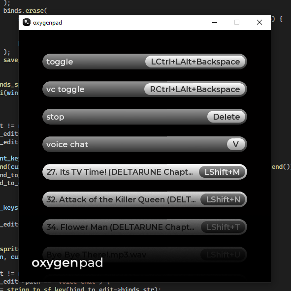
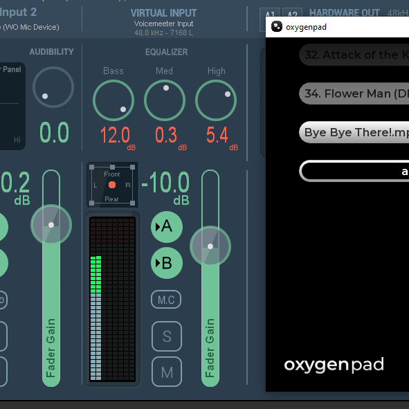
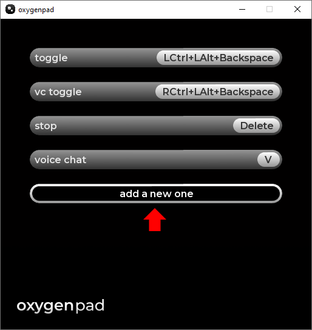

# oxygenpad
### [ Русский ](src/repo/rus.md)
A lightweight FOSS alternative to Soundpad
<table>
  <tr>
    <td></td>
    <td></td>
  </tr>
</table>

## If you are lazy like me, you can watch [my guide to the installation and usage of oxygenpad](https://www.youtube.com/watch?v=0gOVyRFAF88)

## Usage
### Opening GUI (oxygenpad control panel)
1. Go to taskbar
1. Search for oxygenpad icon in tray
1. Click on it
1. Click on "gui" button
### Adding your sounds
1. Scroll down and click the **add a new one** button   
1. Select your `.wav` or `.mp3` or `.flac` audio file
1. Edit keybind for it
 > *to be exact:* this copies chosen file into oxygenpad's `res/sounds/` directory
### Editing keybinds
1. Left-click on desired sound
1. Press your desired keys
### Deleting sounds
1. Right-click on desired sound
> *to be exact:* this does not delete the physical file from your drive; it just simply deletes it from `sounds.map`

## Installation
### On Windows:
#### To install oxygenpad you will need to:
- Download and install the latest version of [VB-AUDIO Voicemeeter](https://vb-audio.com/Voicemeeter/)
- Configure VB-AUDIO Voicemeeter
- Download the latest release of the oxygenpad
- Move it into desired folder
#### Step 1. Getting VB-AUDIO Voicemeeter 
1. Go to [VB-AUDIO Voicemeeter download page](https://vb-audio.com/Voicemeeter/)
2. Download the .zip archive
3. Unpack the archive
1. Run `voicemeetersetup.exe`
#### Step 2. Configuring VB-AUDIO Voicemeeter
1. Open `Voicmeeter x64` from Start Menu
1. Set `Stereo Input 2` as your primary microphone 
2. Open menu
3. Tick these options 
4. Set your mic in desired app (e.g., Discord, TF2, Steam) to be `Voicemeeter Out B1`
#### Step 3. Downloading the app
1. Go to the [Releases](https://github.com/kafelbb/oxygenpad/releases) page.
2. Grab latest version of the prog
3. Move it into any folder (e.g `Desktop/apps/`)
4. Create a shortcut to the prog and move it to your desktop (or Start Menu)

### On Linux:
Currently there is zero Linux support. But I am planning to add it in the future. I will look into adding Pulsemeeter support.

## Compiling
### If you are a masochist, then:
#### On Windows:
1. Ensure you have vcpkg installed
1. Open project in Visual Studio (2022)
1. Configure CMake cache for desired configuration (e.g x64-Release, or x64-Debug)
1. Compile `oxygenpad.exe`  
> In theory VS should automatically install every dependency I guess? (in theory)
#### On Linux:
On Linux compilation process is mostly the same, with an exceptions for some win32-specific parts of code

## Troubleshooting

#### Check [Issues](https://github.com/kafelbb/oxygenpad/issues) page, and if there is no post talking about your problem, then:

1. Launch `oxygenpad.exe` via `cmd.exe`
1. Replicate the issue
1. Copy the logs (cmd output) from cmd window
1. Paste it in Issue description
1. (optionally, but recommended) add a screenshot of your problem
1. Type out your OS version and build number and your hardware specs

_ __
## License

This project is licensed under the **GNU General Public License v3.0 (GPL-3.0)** - see the [LICENSE](LICENSE) file for details.

### Third-Party Licenses
**oxygenpad** uses the following libs:
* **SFML** - Licensed under the [zlib/png license](https://github.com/sfml/sfml?tab=Zlib-1-ov-file).
* **miniaudio** - Choice of [Public Domain](https://unlicense.org)/[MIT license](https://opensource.org/license/mit).
* **portable-file-dialogs (pfd)** - Licensed under the [WTFPL](https://www.wtfpl.net/).
* **tray.h** - Licensed under the [MIT license](https://opensource.org/license/mit).

All of these third-party licenses are permissive and **fully compatible** with GNU GPL v3.
